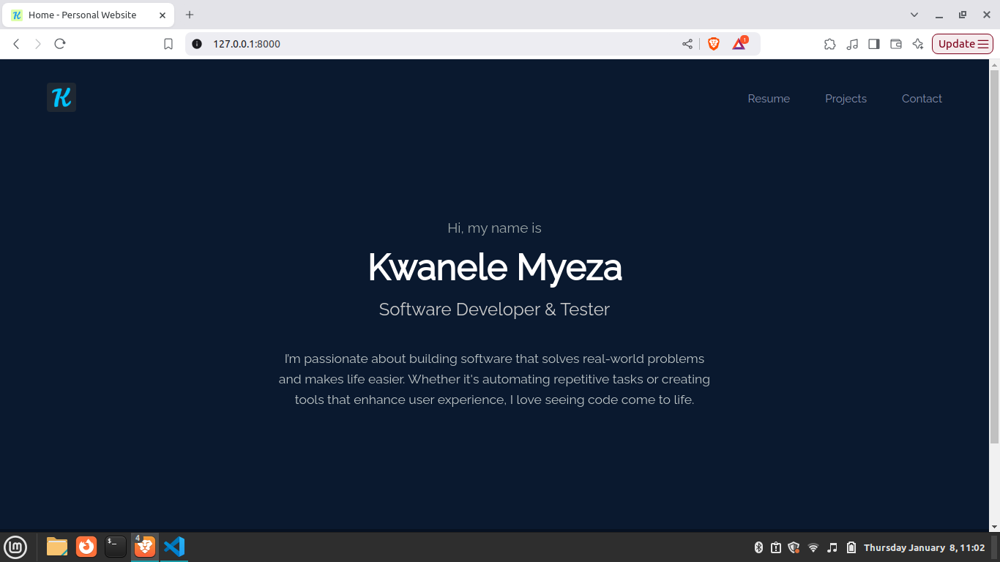
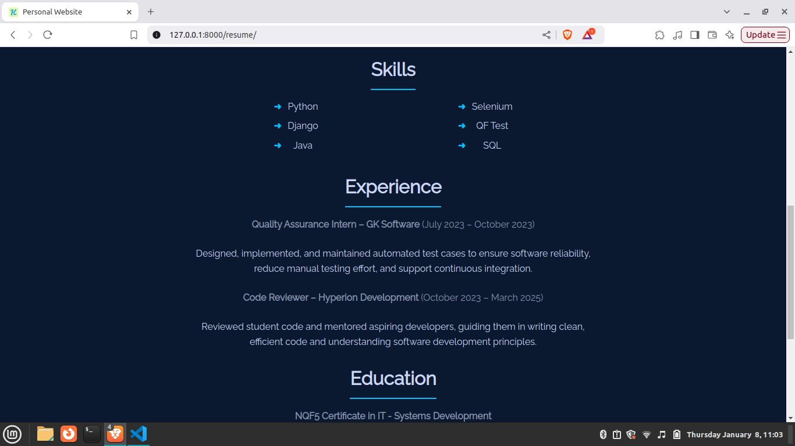
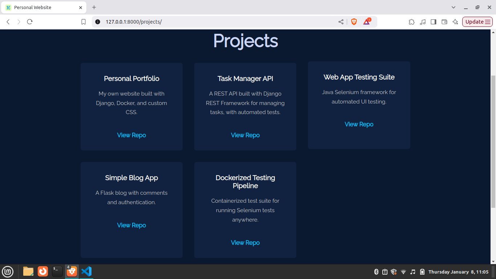

# Personal Portfolio Website

This is my personal website built with **Django**, showcasing my resume, projects, and other information.  

The site includes:
- **Home Page** – Introduction and welcome.
- **Resume Page** – My professional experience and skills.
- **Projects Page** – Overview of projects with GitHub links.
- **Contact Page** – Reach out to me!


## Tech Stack

- **Backend:** Django 5.1
- **Database:** SQLite (local) or PostgreSQL (optional)
- **Web Server:** Gunicorn
- **Static Files:** Collected using Django’s `collectstatic`


## Screenshots

### Home Page


### Resume Page


### Projects Page


### Contact Page


## Setup Instructions (Local Development)

1. **Clone the repository**
```bash
git clone https://github.com/KwaneleMyeza/personal-website
cd personal-website
```

2. **Create a virtual environment**
```bash
python -m venv venv
source venv/bin/activate  # On Windows: venv\Scripts\activate
```

3. **Install dependencies**
```bash
pip install -r requirements.txt
```

4. **Apply migrations**
```bash
python manage.py migrate
```

5. **Run the development server**
```bash
python manage.py runserver
```

6. Visit http://127.0.0.1:8000 in your browser.
